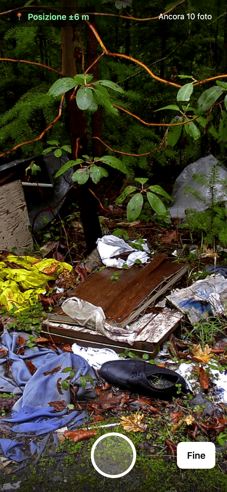
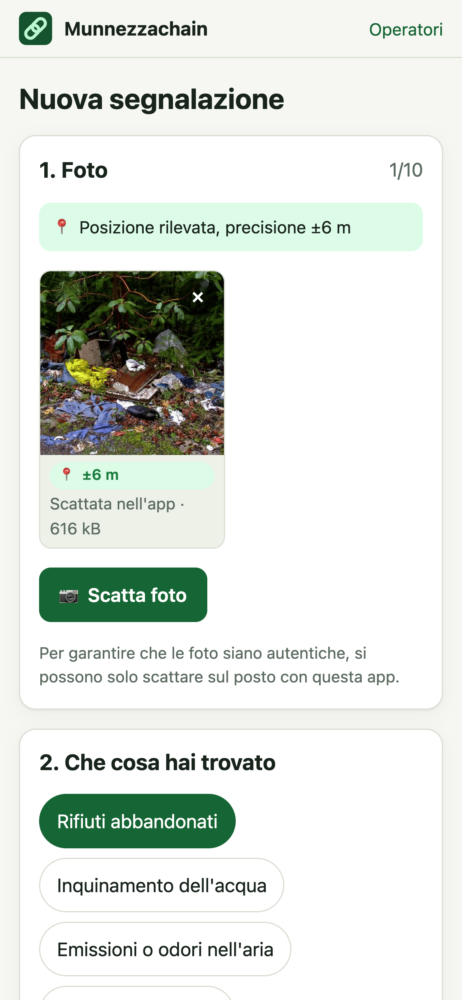
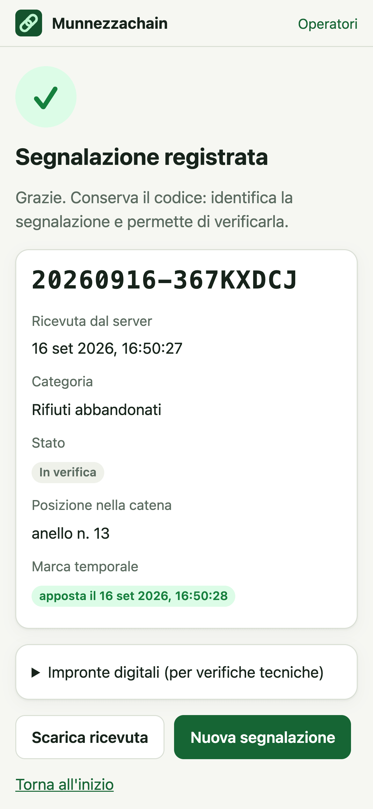
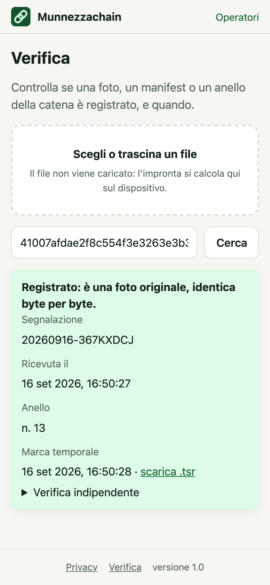
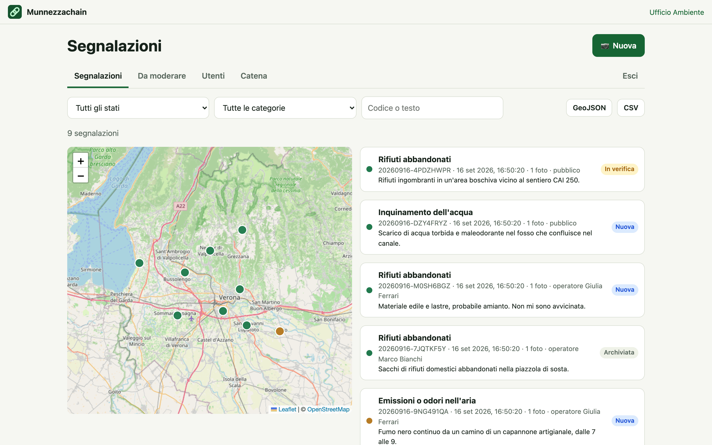
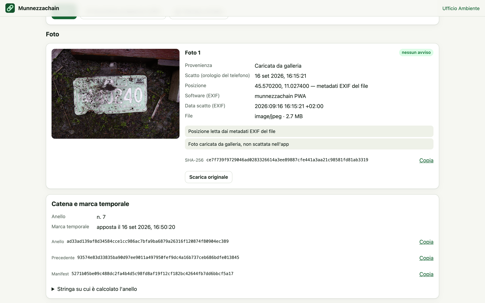
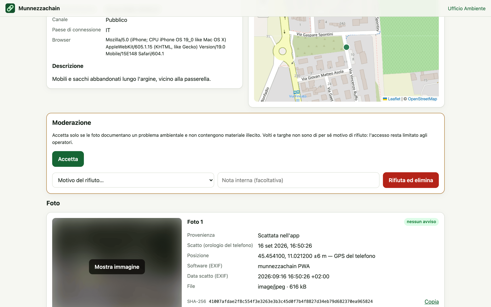
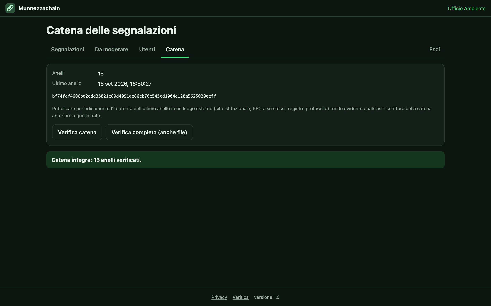

# Munnezzachain

Web app installabile (PWA) per segnalare problemi ambientali, come rifiuti abbandonati, scarichi nei fiumi, fumi e suoli contaminati, con foto la cui **posizione, ora e integrità** restano verificabili fino al rapporto legale.

Produzione: https://munnezzachain.margiovanni.it

<p align="center">
  
  
  
  
</p>

## Il problema

Un ente che fa monitoraggio ambientale deve documentare con foto i propri rapporti. Quelle foto finiscono in un portale istituzionale e possono portare a sanzioni o denunce, quindi devono dimostrare **dove e quando** sono state scattate: l'operatore controlla che la posizione corrisponda all'area, e il GPS serve anche a mettere le segnalazioni su una mappa in automatico.

Le foto però arrivano da persone diverse. I ranger hanno telefoni gestiti dall'ente; turisti, escursionisti e collaboratori esterni no. E i canali che tutti usano rovinano le prove:
- **Posta e chat:** Gmail, Outlook e le app di messaggistica rimuovono il GPS o lo azzerano, anche quando la foto è allegata come file.
- **Selettori di foto:** quelli di iOS e Android possono togliere la posizione.
- **EXIF:** quello che sopravvive è comunque modificabile a mano, e non regge una contestazione.

Il punto debole non è la conservazione ma la **catena tra il sensore e l'archivio**. Munnezzachain la accorcia: non si fida del file che arriva, la foto si scatta dentro l'app, e ogni passaggio successivo lascia un'impronta verificabile.

## Chi lo usa

| | Come accede | Cosa fa |
|---|---|---|
| **Pubblico**: turisti, escursionisti, collaboratori | nessun account | scatta foto nell'app e invia la segnalazione, che resta in quarantena finché un amministratore non la accetta; verifica un file |
| **Operatori**: ranger, ufficio | account creato dall'amministratore | invia segnalazioni, anche da galleria; lavora quelle accettate su mappa ed elenco; esporta CSV, GeoJSON e pacchetti probatori |
| **Amministratori** | account creato dall'amministratore | modera il pubblico, gestisce gli utenti, verifica l'integrità dell'intera catena |

## Come funziona

1. **Scatto in app.** La PWA apre la fotocamera e legge nello stesso istante il GPS del telefono. Scrive nel file data, ora, posizione e precisione, e calcola lo SHA-256 prima dell'invio. Il pubblico può solo scattare; gli operatori possono anche caricare dalla galleria, con avvisi sulla provenienza.
2. **Anche senza rete.** La segnalazione viene salvata sul telefono prima di qualsiasi invio e parte da sola quando torna il segnale.
3. **Invio verificato.** Il server ricalcola l'impronta di ogni foto e rifiuta quelle cambiate anche di un byte. Legge l'EXIF e segnala le incongruenze: posizione imprecisa o manuale, GPS azzerato da un'app, software di fotoritocco, orologio del telefono avanti, invio molto ritardato.
4. **Catena di impronte.** Ogni segnalazione ha un manifest in JSON canonico, legato alla precedente da un hash: modificarne una a posteriori rompe tutte le successive.
5. **Marca temporale RFC 3161** di una Time Stamping Authority esterna sull'impronta di ogni anello, verificabile con `openssl`.
6. **Moderazione.** Le segnalazioni del pubblico restano in un'area di quarantena cancellabile. Se accettate passano nell'archivio non modificabile (R2 bucket lock, 10 anni); se rifiutate vengono distrutte, lasciando solo l'impronta.
7. **Pacchetto probatorio.** Per ogni segnalazione accettata, uno ZIP con:
   - gli originali byte per byte e il manifest;
   - la posizione nella catena e la marca temporale;
   - il registro di chi l'ha vista ed esportata;
   - le istruzioni per verificare tutto con `shasum` e `openssl`.
8. **Verifica pubblica.** Chiunque può controllare se un file è registrato: l'impronta si calcola sul proprio dispositivo e il file non viene caricato.

Dettagli e formula dell'anello: [La catena di custodia](docs/catena.md).

## Pannello operatori



| | |
|---|---|
|  |  |
| Ogni foto con provenienza, posizione, EXIF, avvisi e impronte | Le segnalazioni del pubblico si moderano con l'immagine sfocata |



Gli screenshot si rigenerano con `npm run screenshots` su dati di esempio; [crediti delle foto](docs/screenshots/CREDITI.md).

## Sicurezza in breve

- **Abusi:**
  - login e invii pubblici protetti da **Cloudflare Turnstile**, oltre a limiti per indirizzo IP;
  - al massimo 10 foto e 60 MB per segnalazione.
- **Accesso:**
  - password PBKDF2, e la password provvisoria va cambiata al primo accesso;
  - sessioni in cookie `HttpOnly`/`SameSite=Strict`;
  - login a tempo costante, quindi non rivela quali email esistono;
  - controllo dell'origine sulle richieste che modificano dati.
- **Prove:**
  - trigger del database che impediscono modifiche a catena, foto e registro accessi;
  - archivio R2 con blocco di conservazione;
  - moderazione atomica: un contenuto rifiutato non può finire nell'archivio non cancellabile.
- **Robustezza:** un cron ogni 10 minuti ripete le marche temporali fallite, completa le operazioni interrotte e pulisce la quarantena.
- **Dati:** in UE (D1 e R2 con giurisdizione `eu`).

Controlli, limiti noti e cosa non è coperto: [Sicurezza e robustezza](docs/sicurezza.md).

## Documentazione

- [La catena di custodia e come verificarla](docs/catena.md)
- [Sicurezza e robustezza](docs/sicurezza.md)
- [Deploy e configurazione](docs/deploy.md): risorse Cloudflare, bucket lock, Turnstile, checklist prima dell'apertura
- [Decisioni architetturali](docs/adr/README.md)

## Architettura

```
Telefono (PWA)                     Cloudflare Worker (Hono)                  Archivio
─────────────                      ────────────────────────                  ────────
fotocamera + GPS                   /api/segnalazioni                         D1 (eu): segnalazioni, catena,
EXIF + SHA-256          ──────▶    Turnstile, limiti, verifica impronte ──▶      utenti, registro accessi
coda IndexedDB offline             manifest + anello della catena            R2 (eu): quarantena/ e archivio
Turnstile                          marca temporale RFC 3161 ──▶ TSA               bloccato (originals/, derived/,
service worker                     cron: riprove e pulizia                        manifests/, tsa/)
```

```
src/shared/   EXIF, impronte, modello dati, limiti e catena (usati da browser e Worker)
src/worker/   API: accesso, invio, moderazione, archivio, catena, marca temporale, ZIP
src/web/      PWA senza framework: viste, fotocamera, coda offline, Turnstile, service worker
migrations/   schema D1 con trigger che impediscono modifiche ai dati probatori
scripts/      build versionata, icone, creazione amministratore, screenshot
test/         test unitari (vitest) ed end-to-end su istanza locale (test/e2e)
docs/         catena, sicurezza, deploy, ADR, screenshot
```

## Comandi

```sh
npm run dev           # build di sviluppo + wrangler dev su http://localhost:8787
npm test              # test unitari
npm run test:e2e      # end-to-end: API, browser, Turnstile, offline, aggiornamenti, accessibilità
npm run typecheck     # tipi di Worker, PWA e service worker
npm run test:all      # tutti i controlli
npm run deploy        # rifiuta modifiche non committate, controlli, build versionata e deploy
node scripts/create-admin.ts <email> "<Nome>" [--local]   # crea o reimposta un amministratore
```

Gli end-to-end servono Chrome o Chromium e la rete verso Cloudflare Turnstile. Su GitHub Actions girano a ogni push.

## Limiti

La catena dimostra che nulla è stato alterato **dallo scatto in poi**, e quando la segnalazione è stata registrata. Non può dimostrare che il telefono non fosse manomesso, né che la scena non fosse allestita. Per il pilota la marca temporale viene da FreeTSA; per il pieno valore legale serve una TSA qualificata eIDAS. Per una perizia certificata esistono servizi di acquisizione forense dedicati.
